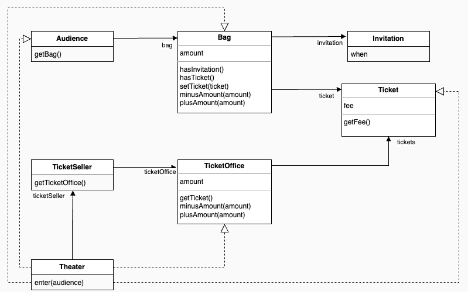
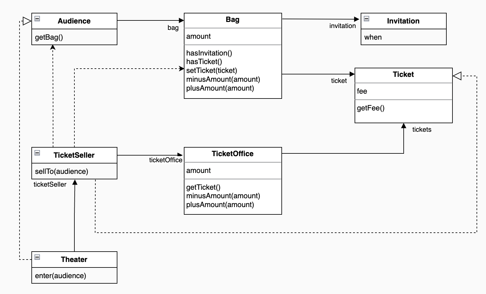
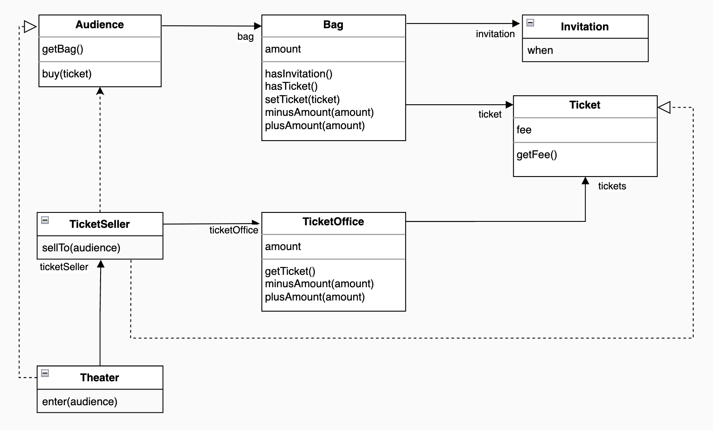
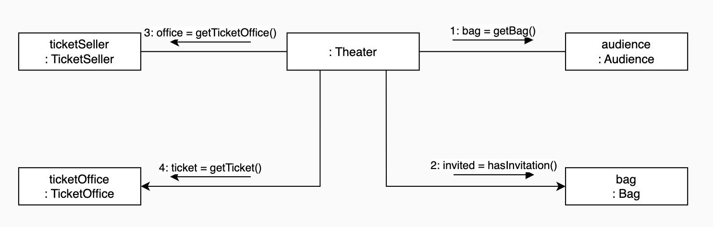
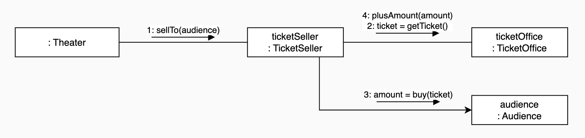
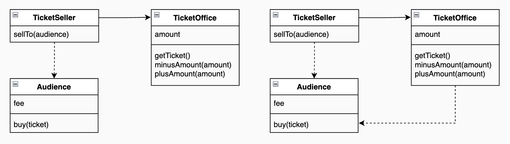
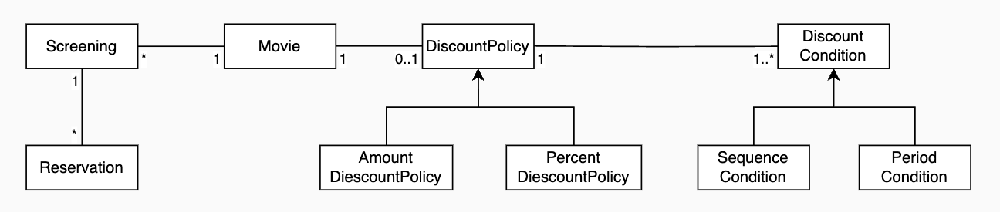
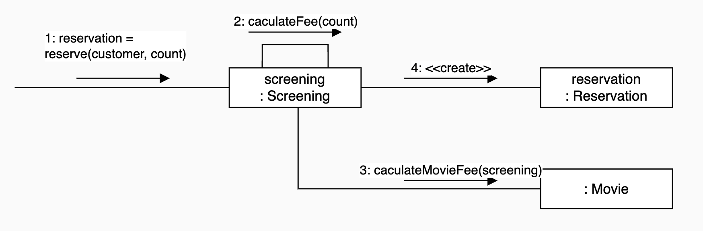

# objects_study

책 스터디를 위해 작성하는 프로젝트

[오브젝트: 코드로 이해하는 객체지향 설계 - 조영호](https://product.kyobobook.co.kr/detail/S000001766367)

## chapter 1. 객체, 설계

### verse 1. 티켓 판매 애플리케이션 구현하기
- 연극이나 음악회를 공연할 수 있는 작은 소극장
- 홍보를 위해 이벤트 기획
- 초대장을 받은 관람객은 티켓으로 교환한 후에 입장
- 초대장을 받지 못한 관람객은 티켓을 구매 후 입장
- 따라서, 관람객을 입장시키기 전에 이벤트 당첨 여부 확인, 당첨자가 아닌 경우 티켓을 판매 후 입장시켜야 함

### verse 2. 무엇이 문제인가
- 로버트 마틴의 클린 소프트웨어에 의하면 모든 모듈은 제대로 실행돼야 하고, 변경이 용이해야 하며, 이해하기 쉬워야 한다.
- 코드를 이해하기 위해 여러 가지 세부적인 내용들을 한꺼번에 기억하고 있어야 한다는 점은 코드를 이하해기 어렵게 만든다.
- Theater class의 enter method가 수행하는 일
  - 예상을 벗어나는 코드
    - 관람객과 판매원이 소극장의 통제를 받는 수동적인 존재가 되었음
  - 변경에 취약함
    - 관람객이 항상 가방을 들고다니는 것을 가정
    - 판매원이 매표소 안에 있을 것을 가정
    - 위 가정만 깨지더라도 코드를 변경하기 어려워짐
    - 객체간 의존성 문제(높으 결합도). 필요한 최소한의 의존성만 유지하고 불필요한 의존성 제거 필요

### verse 3. 설계 개선하기
- 코드를 이해하기 어려운 이유
  - Theater가 관람객의 가방과 판매원의 매표소에 직접 접근하기 때문
  - 관람객과 판매원이 자신의 일을 스스로 처리한다는 직관을 벗어남
- 해결 방법 (a)
  - Theater가 Audience와 TicketSeller에 관해 너무 세세한 부분까지 알지 못하도록 정보 차단
  - Theater에서 TicketOffice로의 의존성이 제거되어 TicketOffice와 협력하는 TicketSeller의 내부 구현이 성공적으로 캡슐화
  
- 해결 방법 (b)
  - 해결 방법 (a)로 개선해도 Audience가 TicketSeller 입장에서 완전히 자율적이지 못함
  - Audience의 Bag에 접근하는 객체를 TicketSeller가 아닌 Audience로 이동하여 캡슐화
  - TicketSeller가 Audience의 인터페이스에만 의존(필요한 의존)
  
- 절차적 프로그래밍 (그림 1.2)
  - 그림 1.2는 절차적 프로그래밍 방식으로 작성된 코드의 전형적인 의존성 구조
    - Theater.enter : Process
    - Audience, TicketSeller, Bag, TicketOffice : Data
  - Theater에 책임이 중앙집중
    
- 객체 지향 프로그래밍
  - 각 객체는 자신을 스스로 책임짐
  - 객체에 어떤 책임을 할당할 것이냐에 대한 초점
  - 책임이 분산된 객체 지향 프로그래밍
    
- 해결 방법 (c)
  - Audience의 Bag에게 자율성 부과
  - TicketSeller의 TicketOffice에게 자율성 부과
    - plusAmount()를 private으로 변경 가능
    - 단, TicketOffice와 Audience간의 의존성 추가
    - TicketOffice의 자율성은 높였지만 전체 결합도 상승
    
- 실생활과의 괴리
  - Audience와 TicketSeller는 실생활에서도 자신의 일을 자신이 처리
  - Theater, Bag, TickeOffice는 그렇지 않음 -> 객체 지향에서는 능동적이고 자율적인 존재로 변화: (의인화)

## chapter 2. 객체지향 프로그래밍

### verse 2. 객체지향 프로그래밍을 향해
영화 예매 시스템 - 도메인 설계

- 자율적인 객체
  1. 객체는 상태와 행동을 함꼐 가지는 복합적인 존재
  2. 스스로 판단하고 행동하는 자율적인 존재
  - 대부분의 객체지향 프로그래밍 언어들은 접근 제어와 접근 수정자를 제공
    - 외부에서 접근 가능한 부분 : public interface
    - 내부에서만 접근 가능한 부분 : implementation
      - 변경될 가능성이 있는 세부적인 구현 내용을 private 영역 안에 감춤으로써 변경으로 인한 혼란을 최소화할 수 있음
    => 이를 구분하는 것은 객체지향의 핵심 원칙이며, 프로그래머가 알아야 할 지식의 양이 줄고 클래스 작성자가 자유롭게 구현을 변경할 수 있는 폭이 넓어짐
- 협력 관계 (1)
  - Screening, Reservation, Movie 사이의 협력 관계
  